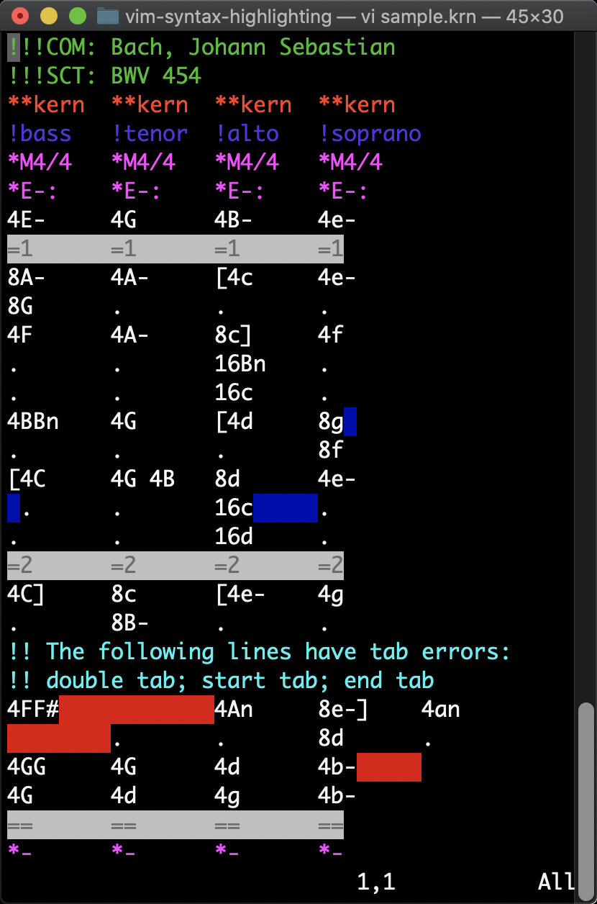

[Vim](https://www.vim.org) is a text editor that works well with
Humdrum files and tools.  The [vim configuration file](humdrum.vim)
given below can be used to highlight the structure of Humdrum files,
such as barlines, tandem interpretations, spine manipulators, and
local and global comments.

There are two ways in which the configuration file can be used:

<dl>
<dt>Manual loading</dt>
<dd markdown="1">

Type the command `:so humdrum.vim` if the file is in the current 
working directory to load the humdrum syntax file.

</dd>

<dt>Automatic loading</dt>
<dd markdown="1"> 

(1) Save the syntax highlighting file to a file called `~/.vim/humdrum.vim`.

(2) In `~/.vimrc` add these lines:


```vim
syntax on
au BufRead,BufNewFile *.hmd set filetype=humdrum 
au BufRead,BufNewFile *.krn set filetype=humdrum 
au! Syntax humdrum  source ~/.vim/humdrum.vim
```


</dd>
</dl>


## Syntax highlighting sample ## 


On the right is an example of syntax highlighting in vim using the
following coloring conventions ([sample file](sample.krn)):


<table>
<tr><td>Green		</td><td> Bibliographic records </td></tr>
<tr><td>Cyan		</td><td> Global comments	</td></tr>
<tr><td>Blue		</td><td> Local comments	</td></tr>
<tr><td>Pink		</td><td> Tandem interpretations </td></tr>
<tr><td>Red		</td><td> Exclusive interpretations </td></tr>
<tr><td>Background	</td><td> Invalid tabs		</td></tr>
</table>


Syntax highlighting designed for the `**kern` representation:

<table>
<tr><td>White Background</td><td>Measure lines</td></tr>
<tr><td>White Highlighted</td><td>Chords</td></tr>
<tr><td>Blue Background	</td><td>Invalid chording spaces</td></tr>
</table>

## Syntax file ## 

The following text can be saved to the file `~/.vim/humdrum.vim`,
or download from [this link](humdrum.vim).

```vim

```


